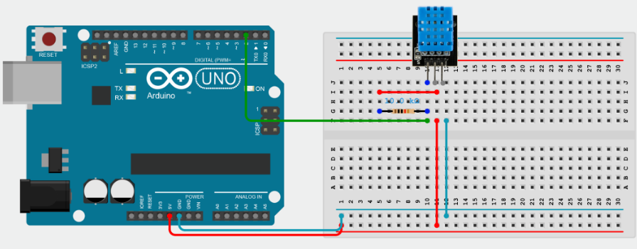
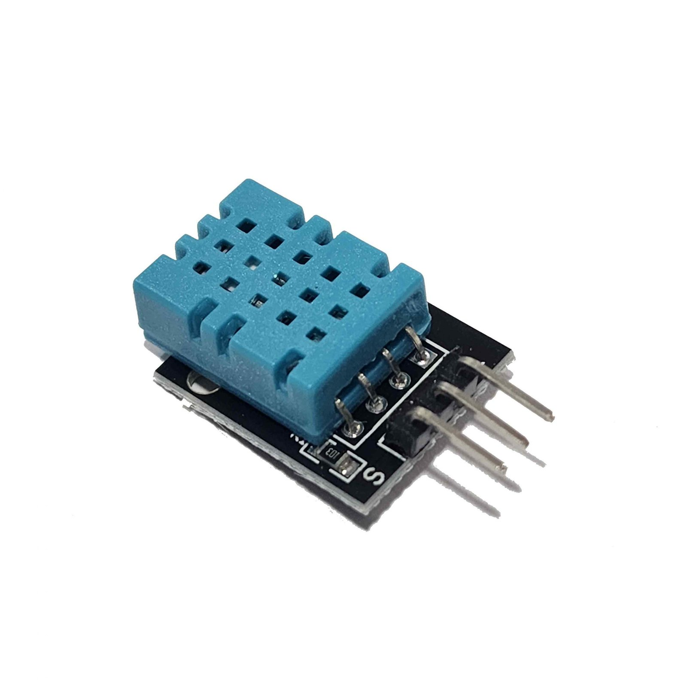
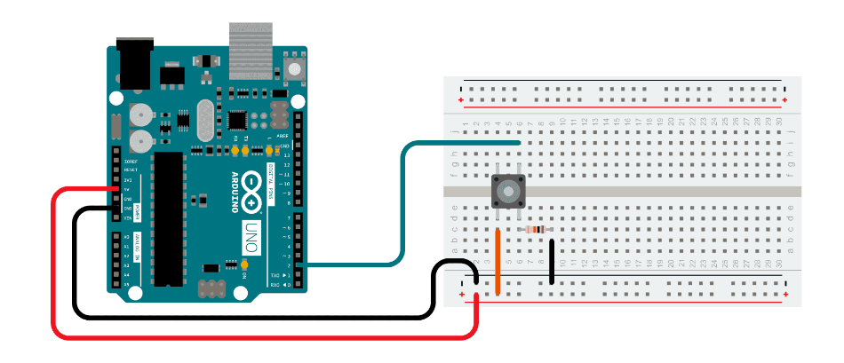
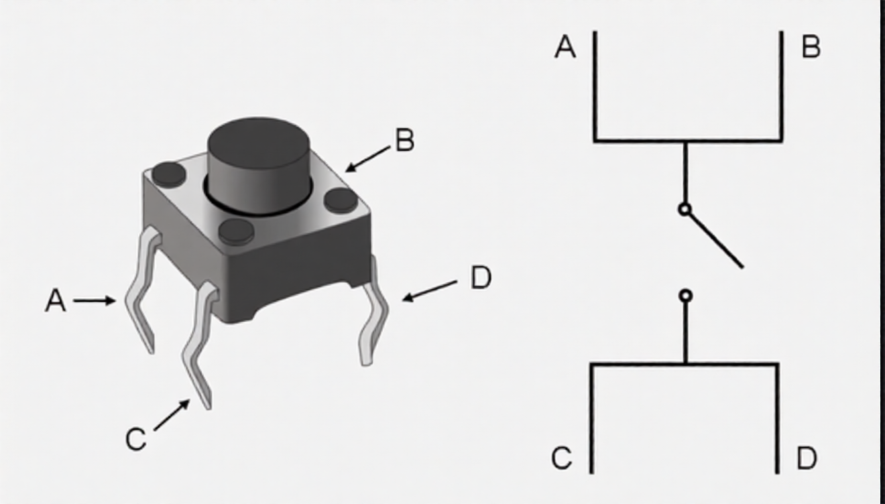
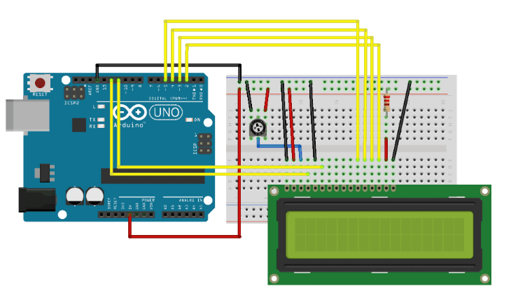
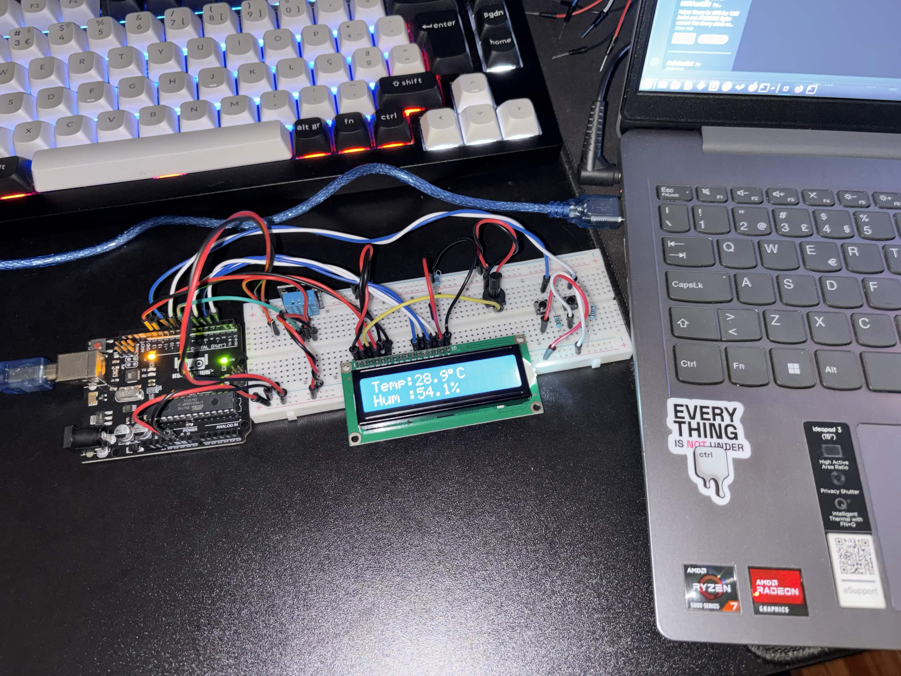
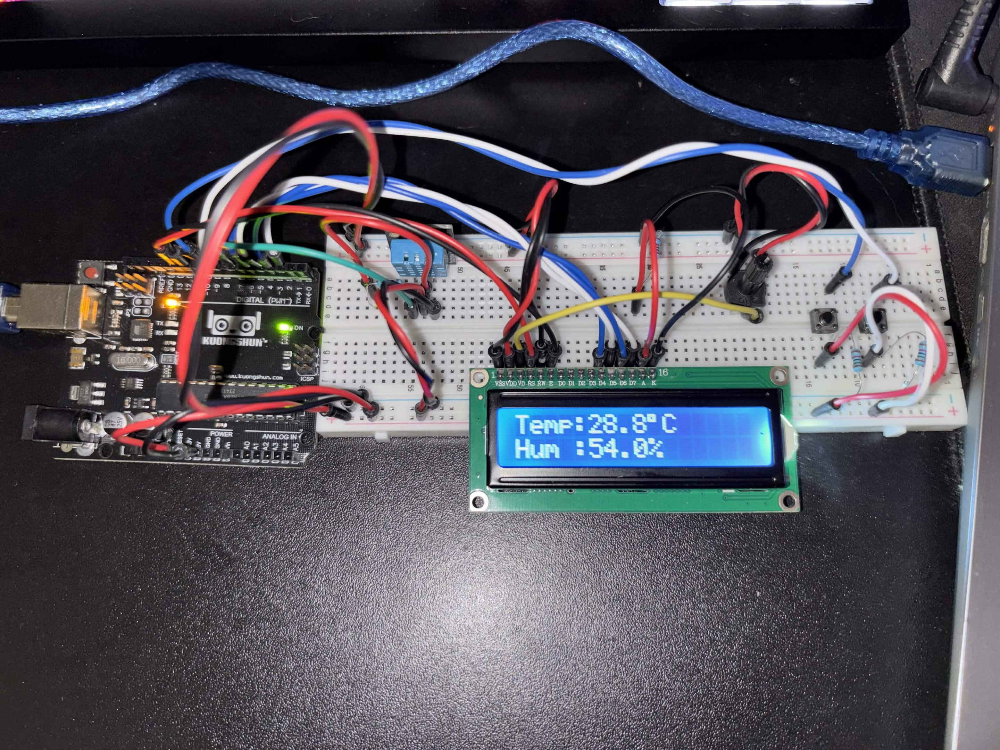
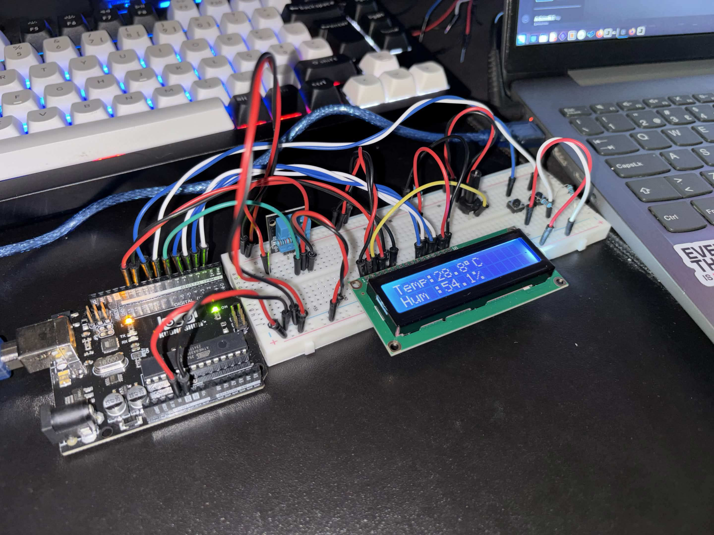

# Embedded Environmental Monitor (LCD / DHT)

Arduino-based environmental monitoring solution designed to track indoor climate metrics in real time. By interfacing a DHT11 sensor with a 16x2 LCD display, the system processes live temperature and humidity telemetry directly on the microcontroller, providing clear and instantaneous visual output.

## Features
- Real-Time Telemetry: Instant continuous updates for ambient temperature (°C) and relative humidity (%).
- Modular Hardware Architecture: Circuit design and pin mapping structured for quick testing, hardware isolation, and easy component swapping.
- Efficient Polling Cycle: Optimized code logic to prevent sensor heating and ensure accurate readings without blocking execution loops.

## Hardware
- Arduino Uno/Nano
- DHT11 sensor
- 16x2 LCD display
- 2x push buttons

## Hardware Setup
I'll show you how to setup every single circuit isolated, so it's easy to follow along and to assemble the full setup.
After that you just need to put put them all togheter in the breadboard and edit the code with the pins you've used.

###  [DHT11 Sensor](https://components101.com/sites/default/files/component_datasheet/DFR0067%20DHT11%20Datasheet.pdf)

  
  

### [Push Buttons](https://components101.com/switches/push-button)

  
  

### [LCD Display](https://www.vishay.com/docs/37484/lcd016n002bcfhet.pdf)

  

| LCD         | Arduino    | LCD        | Arduino               |
|-------------|------------|------------|-----------------------|
| RS          | Digital 12 | RW         | GND                   |
| Enable (E)  | Digital 11 | VSS        | GND                   |
| D4          | Digital 5  | VCC        | 5V                    |
| D5          | Digital 4  | LED+ (A)   | 5V (220Ω)             |
| D6          | Digital 3  | LED- (K)   | GND                   |
| D7          | Digital 2  | Vo         | Potentiometer Output  |

### Final Assembly ([Demo](images/IMG_7684.mp4))

  
  
  
  
  

https://github.com/user-attachments/assets/131c299c-a692-46e8-a27a-be6d3c95b56f
